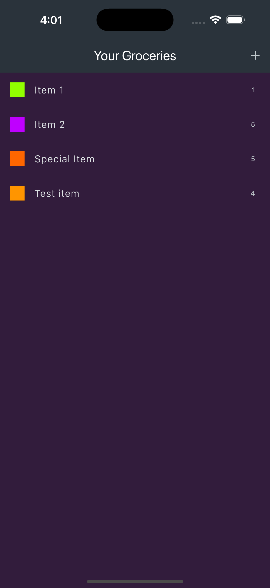
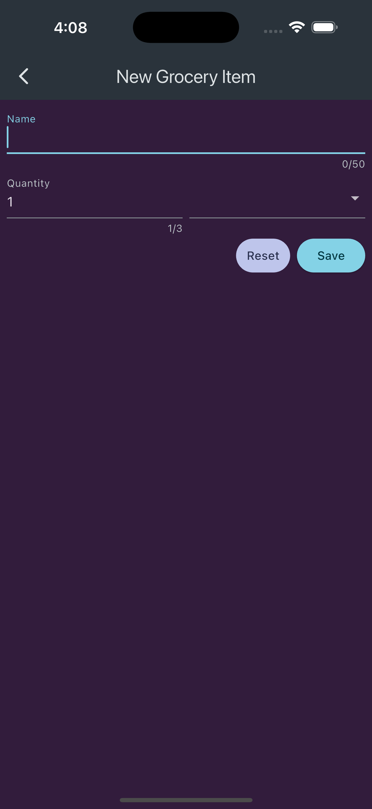
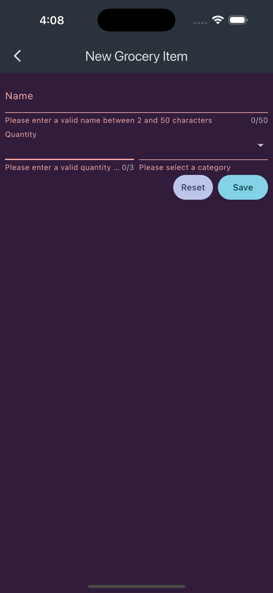
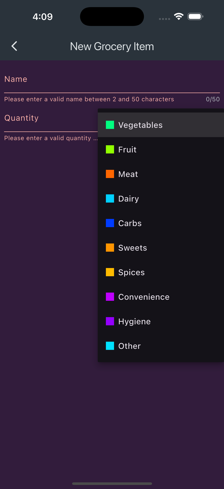

# Grocery Shopping List

A simple grocery shopping list app built with Flutter.

## Getting Started

This project is a starting point for a Flutter application.

### Prerequisites

- [Flutter](https://flutter.dev/docs/get-started/install) installed on your machine.
- An IDE such as [Visual Studio Code](https://code.visualstudio.com/) or [Android Studio](https://developer.android.com/studio).

### Installation

1. Clone the repository:

   ```sh
   git clone https://github.com/abhiroop43/flutter_shopping_list.git
   cd flutter_shopping_list
   ```

2. Install the dependencies:

   ```sh
   flutter pub get
   ```

3. Run the app:

   ```sh
   flutter run
   ```

### Project Structure

- `main.dart`: The entry point of the application.
- `home.dart`: The home page of the application.
- `new_item.dart`: The page for adding a new item to the shopping list.
- `item_model.dart`: The model for a shopping list item.
- `categories.dart`: The data for item categories.

### Features

- Add new items to the shopping list.
- View the list of items.
- Delete completed items.
- Categorize items by type (e.g., vegetables, fruits, meat).

### Screenshots

<p>
   
   
   
   
</p>

### License

This project is licensed under the MIT License - see the LICENSE file for details.
